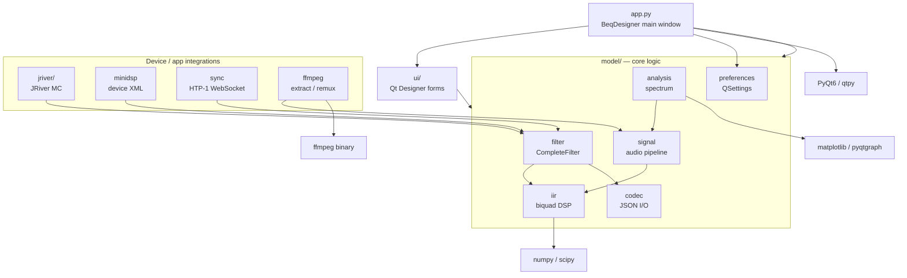

# Architecture

BEQDesigner is a PyQt6 desktop application. The source tree under
`src/main/python/` is organised by role: a thin entry point, a Qt UI layer, a
set of model modules holding the business/DSP logic, and a handful of
integrations with external audio devices and media players.

## Entry point

`app.py` creates the `QApplication` and the `BeqDesigner(QMainWindow)` that is
the app's main window. It wires together every major subsystem: menu actions,
the filter table, chart rendering, signal loading, preferences, and version
checking. UI widgets are drawn from Qt Designer forms compiled into `ui/`.

## Core models (`model/`)

The `model/` package holds everything that is not Qt view code.

- **`iir.py`** — IIR biquad filter math (peaking EQ, shelves, Linkwitz, Bessel,
  etc). Defines the `SOS` family of filter classes that everything else
  composes into chains.
- **`filter.py`** — `CompleteFilter` model plus the table/editor binding. This
  is the primary object manipulated by the UI and by each device integration.
- **`signal.py`** — loads audio, computes magnitude response, and runs filter
  chains across signals. The largest module in the codebase.
- **`analysis.py`** — spectral analysis (windowed FFT, smoothing) driving the
  frequency/magnitude charts.
- **`codec.py`** — JSON serialisation for filters and projects.
- **`preferences.py`** — `Preferences` wrapper around `QSettings`, with all of
  the well-known key names used throughout the app.
- **`magnitude.py`**, **`limits.py`**, **`report.py`**, **`waveform.py`**,
  **`batch.py`**, **`merge.py`**, **`extract.py`** — chart models, reporting,
  waveform views, and batch/merge workflows built on top of the core.

## Device and application integrations

These modules translate `CompleteFilter` chains into whatever a third-party
device or application expects:

- **`model/jriver/`** — JRiver Media Center integration: reads/writes JRiver
  DSP XML, talks to MCWS over HTTP, and provides the crossover/channel-routing
  editor. Split across `filter.py`, `ui.py`, `codec.py`, `mcws.py`,
  `routing.py`, `render.py`, `parser.py`, `dsp.py`.
- **`model/minidsp.py`** — MiniDSP filter export via the device's XML format.
- **`model/sync.py`** — Monoprice HTP-1 integration over WebSocket (the "sync"
  dialog that pushes/pulls filter banks to the processor).
- **`model/ffmpeg.py`** — invokes the `ffmpeg` binary for audio extraction and
  remuxing filtered streams back into a video container.

## UI layer (`ui/`)

`.ui` files authored in Qt Designer, compiled by `pyuic6` into matching `.py`
files. The generated files are checked in and **must not be hand-edited**. Any
hand-written view code (delegates, custom widgets) lives alongside them as
regular Python modules.

## External dependencies

The app is a thin layer over a short stack of Python audio/scientific
libraries: **PyQt6** (via `qtpy`) for the UI, **numpy** and **scipy** for DSP,
**matplotlib** and **pyqtgraph** for plots, **soundfile** and **soxr** for
audio I/O, and the **ffmpeg** binary for video/audio extraction and remuxing.

## CLI and headless usage

In addition to the desktop GUI, the project ships a unified CLI at
`bin/beq-designer` (driven by `cli/main.py`) for headless workflows:
LFE extraction, profile generation, model training, and reports. The CLI
runs in Docker for NAS deployment as well as locally.

The CLI/model code path is **Qt-free** -- pure data classes
(`model/xy_data.py`) are decoupled from `model/preferences.py` so that
profile generation works without a display server.

## Configuration storage

BEQDesigner splits configuration into two locations based on portability.

### Shared BEQ directory (`BEQ_SHARED_DIR`)

The portable, machine-independent working directory. Same content can be
mounted on a Mac, NAS, or Docker container. Holds anything that is the
same across machines:

| File / dir | Purpose |
|---|---|
| `wav-cache/` | Extracted LFE WAVs (two-letter bucket layout, e.g. `AV/Avatar (2009) [tmdb-19995].lfe-1000hz.wav`) |
| `beq_catalogue.json` | Cached BEQ catalogue from GitHub (24h TTL) |
| `media_inventory.json` | Discovered media files with paths *relative* to media root names, for portability |
| `missing_ids.txt` | Media files missing a `[tmdb-NNN]` / `[tvdb-NNN]` / `[imdb-NNN]` tag |
| `production_model.joblib` | Trained E82 XGBoost model |
| `e85_torch_filter.pt` | Trained E85 differentiable-DSP model |

Resolved by `beq_shared_dir()` in `spike/_auto_beq_helpers.py`:

1. `BEQ_SHARED_DIR` env var (preferred)
2. `shared_beq_dir` key in `~/.config/beqdesigner/settings.json`

If neither is set, the CLI fails fast with instructions.

### Local config directory (`~/.config/beqdesigner/`)

Per-machine settings that should NOT be shared (paths differ between
machines, CLI preferences are per-user). Resolved by `beq_config_dir()`.

| File | Purpose | Schema |
|---|---|---|
| `extract_config.json` | Media library root paths for this machine | `{"media_roots": ["/path/to/movies", ...]}` |
| `settings.json` | Per-machine settings: shared dir mount point, default CLI prefs, integration backends | See below |
| `beqdesigner.log` | Persistent debug log |

**`settings.json` keys:**

| Key | Purpose |
|---|---|
| `shared_beq_dir` | Where the shared BEQ directory is mounted on this machine (used by `beq_shared_dir()` if `BEQ_SHARED_DIR` env var not set) |
| `library_roots` | Media library roots used by the sweep tool (parallel to `extract_config.json` -- to be unified) |
| `ollama_hosts` | Ollama LLM backend URLs (advisor mode) |
| `cli_author` | Default author name on generated profiles |
| `cli_output_dir` | Where to write generated profiles |
| `cli_last_media_dir` / `cli_last_media_file` | Remembered for "browse from last location" in interactive menu |
| `cli_verbose` | Default verbose flag for CLI |

### Why the split

Different machines have different mount points (`/Volumes/Batou/...` on Mac,
`/volume1/...` on Synology, `/media/batou` in Docker). Putting machine-specific
paths in the shared directory would break portability. Putting portable data
(WAV cache, models) in the local config dir would force re-extraction on every
machine.

The rule: **if the value differs between machines, it lives in
`~/.config/beqdesigner/`. If it is the same on every machine, it lives in
the shared BEQ directory.**

In Docker auto-discovery mode (`BEQ_MEDIA_DIR` env var set), the local
`extract_config.json` is rebuilt every container start from whatever is
mounted under `/media/`, so the local config is effectively ephemeral.

## Extraction pipeline

The LFE extraction pipeline (`cli/extract.py`) runs in two phases:

### Phase 1: Catalogue-matched extraction

Extracts LFE audio from media files that match the BEQ catalogue (titles
with known human-authored bass correction profiles). These are the
highest-value training examples because we have ground-truth labels.

### Phase 2: Uncatalogued extraction (E84 unlabelled pool)

Extracts from media that has a database ID but NO BEQ catalogue entry.
These grow the self-training pool -- the model can learn from their
audio characteristics even without human-authored labels.

**Title selection algorithm (greedy bias-corrected diversity scoring):**

The BEQ catalogue has a distribution across three dimensions: audio
format (Atmos, TrueHD, DTS-HD, DD+), era (decade), and content type
(film/TV). Our WAV cache may over-represent some categories and
under-represent others relative to the catalogue.

The selection algorithm works as follows:

1. Compute the distribution gap: for each (format, era, type) bucket,
   what percentage of the catalogue does it represent vs what percentage
   of our cache?
2. Score each uncached candidate by how much it would fill the BIGGEST
   gap -- a title in an under-represented bucket scores higher.
3. Pick the highest-scoring candidate.
4. Update the cache distribution as if we'd already extracted it.
5. Re-score all remaining candidates against the UPDATED distribution.
6. Repeat from step 2 until we've picked N titles.

This greedy re-scoring is key: after picking a DD+ TV show, the DD+/TV
gap shrinks, so the next pick targets the NEXT biggest gap. This ensures
maximum diversity across the training set rather than filling one gap
with many similar titles.

TV shows are deduplicated: one episode per unique title ID. Different
shows teach the model more than multiple episodes from the same show
(same mixer, studio, codec configuration).

### Parallel extraction

When media roots are on separate physical drives (typical NAS layout),
extraction runs one ffmpeg thread per drive. This uses all disks
simultaneously for ~Nx throughput. Disable with `--no-parallel`.
