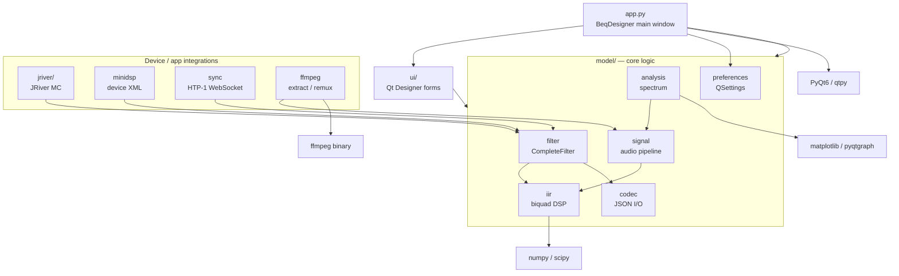

# Architecture

BEQDesigner is a PyQt6 desktop application. The source tree under
`src/main/python/` is organised by role: a thin entry point, a Qt UI layer, a
set of model modules holding the business/DSP logic, and a handful of
integrations with external audio devices and media players.

## Entry point

`app.py` creates the `QApplication` and the `BeqDesigner(QMainWindow)` that is
the app's main window. It wires together every major subsystem: menu actions,
the filter table, chart rendering, signal loading, preferences, and version
checking. UI widgets are drawn from Qt Designer forms compiled into `ui/`.

## Core models (`model/`)

The `model/` package holds everything that is not Qt view code.

- **`iir.py`** — IIR biquad filter math (peaking EQ, shelves, Linkwitz, Bessel,
  etc). Defines the `SOS` family of filter classes that everything else
  composes into chains.
- **`filter.py`** — `CompleteFilter` model plus the table/editor binding. This
  is the primary object manipulated by the UI and by each device integration.
- **`signal.py`** — loads audio, computes magnitude response, and runs filter
  chains across signals. The largest module in the codebase.
- **`analysis.py`** — spectral analysis (windowed FFT, smoothing) driving the
  frequency/magnitude charts.
- **`codec.py`** — JSON serialisation for filters and projects.
- **`preferences.py`** — `Preferences` wrapper around `QSettings`, with all of
  the well-known key names used throughout the app.
- **`magnitude.py`**, **`limits.py`**, **`report.py`**, **`waveform.py`**,
  **`batch.py`**, **`merge.py`**, **`extract.py`** — chart models, reporting,
  waveform views, and batch/merge workflows built on top of the core.

## Device and application integrations

These modules translate `CompleteFilter` chains into whatever a third-party
device or application expects:

- **`model/jriver/`** — JRiver Media Center integration: reads/writes JRiver
  DSP XML, talks to MCWS over HTTP, and provides the crossover/channel-routing
  editor. Split across `filter.py`, `ui.py`, `codec.py`, `mcws.py`,
  `routing.py`, `render.py`, `parser.py`, `dsp.py`.
- **`model/minidsp.py`** — MiniDSP filter export via the device's XML format.
- **`model/sync.py`** — Monoprice HTP-1 integration over WebSocket (the "sync"
  dialog that pushes/pulls filter banks to the processor).
- **`model/ffmpeg.py`** — invokes the `ffmpeg` binary for audio extraction and
  remuxing filtered streams back into a video container.

## UI layer (`ui/`)

`.ui` files authored in Qt Designer, compiled by `pyuic6` into matching `.py`
files. The generated files are checked in and **must not be hand-edited**. Any
hand-written view code (delegates, custom widgets) lives alongside them as
regular Python modules.

## External dependencies

The app is a thin layer over a short stack of Python audio/scientific
libraries: **PyQt6** (via `qtpy`) for the UI, **numpy** and **scipy** for DSP,
**matplotlib** and **pyqtgraph** for plots, **soundfile** and **soxr** for
audio I/O, and the **ffmpeg** binary for video/audio extraction and remuxing.
