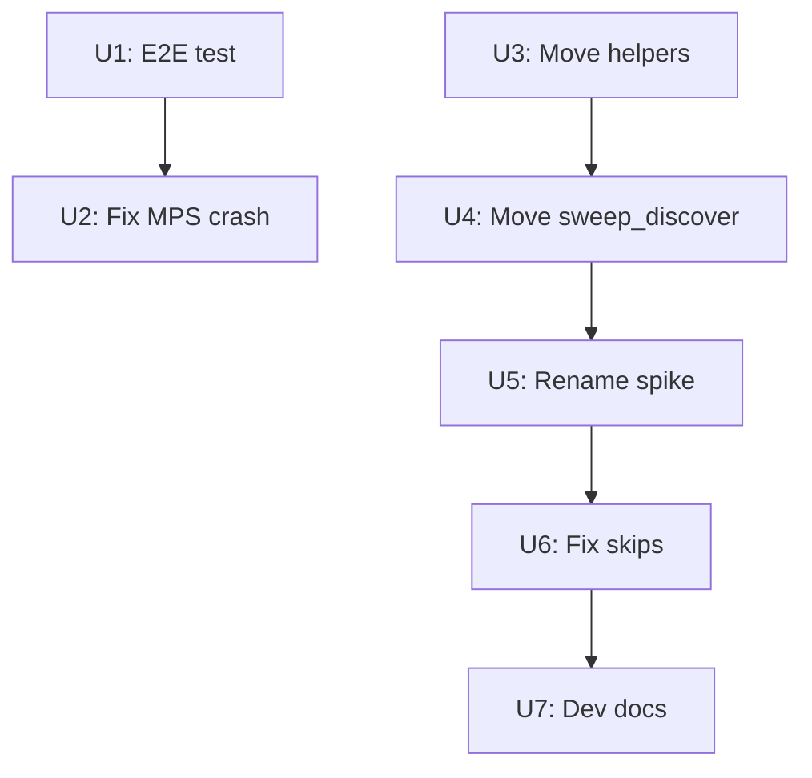

# Test overhaul - E2E coverage, MPS crash, spike restructure

## Overview

Profile generation (the primary user feature) crashes with SIGSEGV on
macOS, and no test catches it. The test suite hides failures behind
markers and skips, and production code lives in a test directory called
"spike". Fix all three: add end-to-end test coverage, fix the MPS
crash, and restructure the code.

## Problem Frame

The SIGSEGV occurs in `cli/generate.py` at the "Loading model" stage.
`joblib.load()` deserializes the xgboost model, and the xgboost C
library initialization conflicts with Metal/MPS state in the process.
Although xgboost trains with `tree_method="hist"` (CPU), the C library
may still probe for GPU backends during initialization.

The crash is invisible because:
- No end-to-end profile generation test exists
- The xgboost-loading tests are excluded from the default suite
- Production code (`_auto_beq_helpers.py`, `sweep_discover.py`) lives
  in `src/test/python/spike/`, making it harder to reason about what's
  test code vs production code

(see origin: `docs/brainstorms/2026-04-21-test-overhaul-requirements.md`)

## Requirements Trace

- R1. End-to-end profile generation test (CI-ready, no external deps)
- R2. Fix xgboost/MPS SIGSEGV on macOS
- R3. Rename spike/ to auto_beq/, move production code to src/main/
- R4. Reduce skipped/deselected tests
- R5. Developer setup documentation

## Scope Boundaries

- Do NOT rewrite the experiment test suite (E1-E87)
- Do NOT change ML algorithms or training logic
- Do NOT restructure src/main/python/model/ (separate effort)

## Context & Research

### Relevant Code and Patterns

- `model/auto_beq_torch.py:_maybe_import_nn()` - the torch MPS fix
  pattern (set env var before import)
- `cli/generate.py:_load_or_train_model()` - where the crash happens
- `model/auto_beq_nn.py:load_model()` - joblib/xgboost load path
- `docs/solutions/runtime-errors/torch-mps-segfault-disable-before-import.md`
  - documented solution for the torch variant of this crash

### Institutional Learnings

- MPS auto-initialization happens at C library load time, not when
  GPU is explicitly requested. Setting env vars after import has no
  effect.
- The two-pass test runner exists specifically because torch+PyQt6
  segfault when loaded in the same process on macOS.

## Key Technical Decisions

- **MPS fix approach:** Set `PYTORCH_MPS_HIGH_WATERMARK_RATIO=0.0`
  before ANY ML library import (xgboost, torch, scipy) in the CLI
  entry point, not per-module. This is simpler and more robust than
  guarding each individual import site. The env var disables MPS
  memory allocation, which prevents the Metal backend conflict.

- **Test approach:** Train a minimal 5-sample XGBoost model during
  the E2E test. This takes ~2s but exercises the real joblib
  serialize/deserialize and prediction code path. No committed model
  fixtures to go stale.

- **Spike rename:** `spike/` -> `auto_beq/` under `src/test/python/`.
  Production code moves to `src/main/python/model/` split by concern.

- **Helpers split:** `_auto_beq_helpers.py` (1683 lines) splits into:
  - `model/audio_extraction.py` - LFE extraction via ffmpeg, WAV
    validation, probe_audio_stream
  - `model/wav_discovery.py` - WAV-catalogue pair matching, unmatched
    discovery, caching
  - `model/training_data.py` - prepare_training_data, feature
    extraction helpers, build_training_dataset

## Phased Delivery

### Phase 1: Test-first crash fix (R1 + R2)

Write the E2E test that catches the crash, then fix the crash.

### Phase 2: Restructure (R3)

Move production code out of test directory, rename spike/.

### Phase 3: Test hygiene + docs (R4 + R5)

Fix skips, add developer setup documentation.

## Implementation Units

### Phase 1: Test-first crash fix

- [ ] **Unit 1: Write E2E profile generation test**

**Goal:** A CI-ready test that exercises the full profile pipeline
with a synthetic WAV and a tiny trained model.

**Requirements:** R1

**Dependencies:** None

**Files:**
- Modify: `src/test/python/spike/test_generate_beq_profile.py`

**Execution note:** Write this test first. It WILL crash with SIGSEGV
on macOS, proving the bug exists. That's the point.

**Approach:**
- Create a synthetic mono WAV (1s of 30 Hz sine at 1 kHz sample
  rate) using numpy + wave module (no ffmpeg needed)
- Train a minimal XGBoost model on 5 synthetic catalogue entries
  using the existing `build_training_dataset()` and
  `train_production_weighted_hybrid()` with minimal params
  (n_estimators=5, max_depth=2)
- Save the model via joblib to a tmp_path
- Call the core prediction path: load model, extract features from
  the synthetic WAV, predict, convert to filters
- Assert: returns a non-empty list of filter dicts with freq, gain,
  Q keys
- No ffmpeg, no real media files, no network, no NAS

**Patterns to follow:**
- `test_auto_beq_nn.py:test_synthetic_roundtrip` for the synthetic
  training pattern
- `cli/generate.py:generate_profile()` for the pipeline sequence

**Test scenarios:**
- Happy path: synthetic WAV + tiny model -> produces list of filter
  dicts with valid freq/gain/Q values
- Error path: missing model file -> clear error message (not crash)
- Integration: the full chain - train model, save, load, extract
  features, predict, decode filters - exercises the same code path
  as `bin/beq-designer profile`

**Verification:** Test crashes with SIGSEGV on macOS (proving the bug
is caught). Test passes on Linux CI.

---

- [ ] **Unit 2: Fix MPS/Metal SIGSEGV for xgboost**

**Goal:** Profile generation no longer crashes on macOS.

**Requirements:** R2

**Dependencies:** Unit 1 (the test proves the fix works)

**Files:**
- Modify: `bin/beq-designer` or `src/main/python/cli/main.py` -
  set MPS env var at CLI entry point before any imports
- Modify: `src/main/python/model/auto_beq_nn.py` - guard in
  load_model() as defense-in-depth

**Approach:**
- Set `PYTORCH_MPS_HIGH_WATERMARK_RATIO=0.0` at the very top of
  the CLI entry point (before any library imports), using
  `os.environ.setdefault()`. This prevents MPS from initializing
  in ANY downstream library (torch, xgboost via Metal, scipy).
- Also set `XGB_USE_CUDA=0` if such an env var exists (research
  during implementation).
- Add defense-in-depth in `load_model()`: set the env var before
  `import xgboost` and before `joblib.load()`.
- The existing per-module torch fix in `_maybe_import_nn()` becomes
  redundant (the entry point handles it) but keep it for standalone
  script usage.

**Test scenarios:**
- The E2E test from Unit 1 now passes on macOS
- Existing torch tests still pass (the env var doesn't break torch)
- Profile generation works end-to-end on macOS

**Verification:** `bin/beq-designer profile` generates a profile on
macOS without SIGSEGV. The E2E test passes.

---

### Phase 2: Restructure

- [ ] **Unit 3: Move production code from spike/ to src/main/python/**

**Goal:** Production code that `cli/` imports lives in `src/main/`
where it belongs, split by concern.

**Requirements:** R3

**Dependencies:** None (can run in parallel with Phase 1)

**Files:**
- Create: `src/main/python/model/audio_extraction.py`
- Create: `src/main/python/model/wav_discovery.py`
- Create: `src/main/python/model/training_data.py`
- Delete: `src/test/python/spike/_auto_beq_helpers.py` (after moving)
- Modify: All 14+ files that import from `spike._auto_beq_helpers`
- Modify: `AGENTS.md` - update shared infrastructure references

**Approach:**

Split `_auto_beq_helpers.py` (1683 lines) into three modules:

`model/audio_extraction.py` (~500 lines):
- `extract_lfe_wav()`, `probe_audio_stream()`, `_have_tool()`
- WAV validation and atomic writes
- ffmpeg command construction
- `ExtractionStrategy`, `STRATEGY_WELCH`, `STRATEGY_BLENDED_07`
- `extract_features_with_strategy()`,
  `cached_extract_features_with_strategy()`

`model/wav_discovery.py` (~400 lines):
- `discover_wav_catalogue_pairs()`,
  `discover_wav_catalogue_pairs_cached()`
- `discover_unmatched_wavs()`,
  `discover_unmatched_wavs_cached()`
- `_match_wavs_to_catalogue()`
- `_latest_wav_mtime()`, `_discovery_cache_signature()`
- Cache loading/saving (pickle + signature)
- Settings helpers: `load_settings()`, `save_settings()`,
  `beq_shared_dir()`, `beq_config_dir()`, `wav_cache_dir()`,
  `audio_cache_dir()`

`model/training_data.py` (~300 lines):
- `prepare_training_data()`
- `build_training_dataset()`
- `check_production_model()`

Update all 14+ import sites in `cli/` and `model/` to import from
the new locations. Keep backward-compatible aliases in a thin
`spike/_auto_beq_helpers.py` stub during transition (just re-exports
from the new modules).

**Execution note:** Characterization-first. Run the full test suite
before and after to verify identical behavior.

**Test scenarios:**
- All existing tests pass with imports from new locations
- The backward-compat stub works for any remaining references
- Each new module is importable without PyQt6 (CLI/Docker safe)

**Verification:** `from spike._auto_beq_helpers import X` works
(via stub). `from model.audio_extraction import X` works (direct).
All tests pass.

---

- [ ] **Unit 4: Move sweep_discover.py to src/main/python/**

**Goal:** The sweep discovery CLI lives in production code, not tests.

**Requirements:** R3

**Dependencies:** Unit 3

**Files:**
- Move: `src/test/python/spike/sweep_discover.py` ->
  `src/main/python/cli/sweep_discover.py`
- Modify: `src/main/python/cli/main.py` - update import
- Modify: Any other files importing from `spike.sweep_discover`

**Test scenarios:**
- `bin/beq-designer` sweep-related commands still work
- All sweep_discover tests pass

**Verification:** `from cli.sweep_discover import ...` works.

---

- [ ] **Unit 5: Rename spike/ to auto_beq/**

**Goal:** The test directory has a meaningful name.

**Requirements:** R3

**Dependencies:** Units 3 and 4 (production code already moved out)

**Files:**
- Rename: `src/test/python/spike/` -> `src/test/python/auto_beq/`
- Modify: All test files that import from `spike.` prefix
- Modify: `pyproject.toml` if needed (pythonpath doesn't change)
- Modify: `.github/workflows/test.yaml` - update any spike references
- Modify: `AGENTS.md` - update test directory references

**Approach:**
- Rename the directory
- Find all `from spike.` imports in test files and update to
  `from auto_beq.`
- The backward-compat stub from Unit 3 stays (now in auto_beq/)
  until all references are updated
- Update `conftest.py` if it references spike

**Test scenarios:**
- All tests pass after rename
- No `from spike.` imports remain in the codebase

**Verification:** `grep -r "from spike\." src/` returns zero results.

---

### Phase 3: Test hygiene + docs

- [ ] **Unit 6: Fix test skips and marker misuse**

**Goal:** Default test suite has zero runtime skips. Tests that need
external resources use markers, not runtime skipIf.

**Requirements:** R4

**Dependencies:** Unit 5 (imports settled)

**Files:**
- Modify: `src/test/python/auto_beq/test_ollama_multihost.py` -
  add `integration` marker instead of runtime skip
- Modify: `src/test/python/auto_beq/test_auto_beq_helpers.py` -
  remove hardcoded developer media path
- Modify: `src/test/python/auto_beq/test_auto_beq_metadata.py` -
  add `integration` marker, don't ping TMDb at collection time

**Test scenarios:**
- `poetry run pytest -m "not integration and not experiment"` has
  zero skips (deselected by marker is OK)
- Ollama tests run when `poetry run pytest -m integration`
- TMDb tests don't block collection when network is unavailable

**Verification:** Default suite output shows `N passed, 0 skipped`.

---

- [ ] **Unit 7: Developer setup documentation**

**Goal:** Developers know how to run each test group and what
external resources they need.

**Requirements:** R5

**Dependencies:** Unit 6

**Files:**
- Modify: `readme.md` - developer setup section
- Modify: `AGENTS.md` - update test instructions
- Modify: `docs/faq.md` - add developer setup Q&A

**Approach:**
Document three test tiers:
1. Default (`poetry run pytest`) - needs: Python 3.13, poetry.
   No external resources. Should always pass.
2. Integration (`-m integration`) - needs: ffmpeg, ffprobe,
   Ollama (optional), TMDb API access, real media files
3. Experiment (`-m experiment`) - needs: populated WAV cache
   (500+ paired WAVs), production model

For each tier, document: what to install, how to configure, what
env vars to set, expected runtime.

**Test scenarios:**
- Test expectation: none - documentation change

**Verification:** A new developer can follow the docs and run
all three test tiers.

## Dependencies

Phases 1 and 2 can run in parallel. Phase 3 depends on Phase 2.

## Risks & Dependencies

| Risk | Mitigation |
|------|------------|
| MPS fix at entry point breaks standalone script usage | Keep per-module guards as defense-in-depth |
| Rename breaks 200+ import references | Backward-compat stub re-exports from new locations; update imports incrementally |
| E2E test is too slow for CI | Minimal model (5 samples, 5 estimators) should train in <2s |
| Split creates circular imports | model/wav_discovery.py imports model/wav_cache.py (same layer); model/audio_extraction.py is independent |

## System-Wide Impact

- **Import graph change:** 14+ files in cli/ and model/ change their
  import source from `spike._auto_beq_helpers` to
  `model.audio_extraction` / `model.wav_discovery` /
  `model.training_data`. The backward-compat stub prevents breakage
  during transition.
- **CLI entry point change:** MPS env var set before any imports.
  Affects all CLI commands, not just profile generation. This is
  intentional - prevents MPS conflicts everywhere.
- **Unchanged invariants:** All function signatures, return types,
  and behaviors remain identical. Only the module locations change.

## Sources & References

- **Origin document:** [docs/brainstorms/2026-04-21-test-overhaul-requirements.md](docs/brainstorms/2026-04-21-test-overhaul-requirements.md)
- MPS fix pattern: `model/auto_beq_torch.py:_maybe_import_nn()`
- Documented solution: `docs/solutions/runtime-errors/torch-mps-segfault-disable-before-import.md`
- Profile pipeline: `cli/generate.py:generate_profile()`
- Model loading: `model/auto_beq_nn.py:load_model()`
