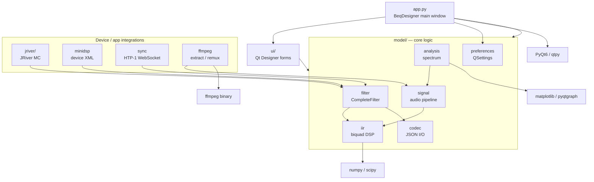

[](https://github.com/3ll3d00d/beqdesigner/actions)

# BEQDesigner

A Qt desktop app for designing, analysing and applying Bass EQ (BEQ) filters for
movie soundtracks.

**User documentation lives at [beqdesigner.readthedocs.io](https://beqdesigner.readthedocs.io/).**
Start there if you want to know what BEQ is, how to install a release build, or
how to use the app. This README is for developers working on the source.

## Developer quickstart

Requirements: Python 3.13, [Poetry](https://python-poetry.org/), and (optional,
runtime only) `ffmpeg` + `graphviz`.

```sh
poetry env use python3.13
poetry install
PYTHONPATH=./src/main/python poetry run python src/main/python/app.py
```

The `PYTHONPATH` prefix matches how CI invokes the app and tests — the source
root is `src/main/python`, not the repo root.

### BEQ CLI

Single entry point for all operations — profile generation, LFE extraction,
cache management, sweep analysis. Run with no arguments for an interactive
menu, or use subcommands directly:

```sh
bin/beq-designer                                    # interactive menu
bin/beq-designer profile "Avatar (2009).mkv"        # generate profile
bin/beq-designer extract --media-root /mnt/media    # extract LFE cache
bin/beq-designer cache-status                       # WAV cache info
bin/beq-designer sweep discover                     # discover + match media
bin/beq-designer --help                             # list all subcommands
```

Preferences are saved on first run and remembered for future invocations.

### Tests

```sh
PYTHONPATH=./src/main/python poetry run pytest --cov=./src/main/python
```

Tests live in `src/test/python/` and run on every push via
`.github/workflows/test.yaml` across Linux, macOS and Windows.

### Building the app bundle

Release binaries are produced by PyInstaller from `beqdesigner.spec`:

```sh
poetry run pip install pyinstaller
poetry run pyinstaller --clean --log-level=INFO beqdesigner.spec
```

On macOS this yields `dist/beqdesigner.app`. On Linux a virtual X server is
required (`Xvfb`) — see the `Create distribution` step in `test.yaml` for the
exact invocation used in CI.

## Project layout

| Path | Contents |
|---|---|
| `src/main/python/app.py` | Entry point — creates `QApplication` and `BeqDesigner` main window |
| `src/main/python/ui/` | Qt Designer `.ui` files and their generated `.py` equivalents, plus view code |
| `src/main/python/model/` | Non-UI logic: filters, signals, IIR, ffmpeg, minidsp, jriver, htp1, checker, preferences, … |
| `src/main/python/acoustics/` | DSP helpers (smoothing, weighting, standards) |
| `src/main/python/mpl.py`, `svg.py`, `style/` | Matplotlib integration, SVG export, mpl styles |
| `src/test/python/` | pytest suite + fixtures |
| `beqdesigner.spec` | PyInstaller build recipe (Windows / Linux / macOS branches) |
| `.github/workflows/` | `test.yaml` (CI) and `create-app.yaml` (release builds) |
| `docs/` | Source for the readthedocs site (MkDocs) |

## Architecture



See [`docs/architecture.md`](docs/architecture.md) for a longer walkthrough of
each subsystem.

## Working with Qt Designer files

Forms are edited as `.ui` files in Qt Designer and compiled to Python with
`pyuic6`:

```sh
cd src/main/python/ui
poetry run pyuic6 foo.ui -o foo.py
```

To regenerate every form at once:

```sh
poetry run ui-gen
# or, equivalently:
poetry run python scripts/regen_ui.py
```

(`src/main/python/ui/convert.sh` and `convert.bat` are kept for reference but
have hard-coded paths to a contributor's venv — prefer `poetry run ui-gen`.)

Generated `.py` files **are** checked in — regenerate them whenever the `.ui`
changes. Do not hand-edit the generated files. To catch this automatically:

```sh
poetry run pip install pre-commit
pre-commit install
```

Once installed, staging a modified `.ui` triggers the hook (defined in
`.pre-commit-config.yaml`), which runs `ui-gen` and re-stages the matching
`.py`. A CI job (`ui-sync-check` in `.github/workflows/test.yaml`) performs the
same check on every push and fails if the committed `.py` files drifted from
their `.ui` sources.

## Conventions worth knowing

- `qtpy` is used as the Qt abstraction layer but the environment is pinned to
  PyQt6 at the top of `app.py`. Import from `qtpy.*`, not `PyQt6.*`, in new code.
- Logging goes through an in-memory `RollingLogger` (`model/log.py`) surfaced
  via *Help → Logs* in the UI — there is no on-disk log file, so run from a
  terminal to see tracebacks.
- User settings are stored via `QSettings` under
  `~/Library/Preferences/com.3ll3d00d.beqdesigner.plist` (macOS) /
  registry (Windows) / `~/.config/3ll3d00d/beqdesigner.conf` (Linux).
- Version string is read from `src/main/python/VERSION` — CI writes the short
  git SHA into this file at build time; running from source without it falls
  back to `0.0.0-alpha.1`.

## Auto-BEQ spike (research)

Research spike exploring automated BEQ filter generation from measured
LFE audio — "take the human out of BEQ-making".

### Quick start: generate profiles for your media

**Prerequisites:** Python 3.13, Poetry, ffmpeg + ffprobe on PATH.

```sh
# 1. Install deps
poetry install

# 2. Configure your audio cache dir + library roots
#    Edit ~/.config/beqdesigner/settings.json:
#    {
#      "audio_cache_dir": "~/Downloads/beqdesigner/audio-cache",
#      "library_roots": ["/path/to/your/Movies", "/path/to/your/TV"]
#    }

# 3. Discover your media and match against the BEQ catalogue
bash scripts/run-sweep-discover.sh

# 4. Run the auto-BEQ pipeline across discovered media
#    (extracts LFE audio, proposes filters, grades against catalogue)
bash scripts/run-sweep-tests.sh
```

Step 3 walks your library roots, finds media files, matches titles
against the BEQ catalogue (~14,700 entries), and saves the results.
Step 4 runs the auto-generation algorithm on each matched file and
compares the output to the catalogue's expert-authored filters.

### Scripts

| Script | Purpose |
|---|---|
| `scripts/run-sweep-discover.sh` | Discover media in your library, match against BEQ catalogue. Interactive: prompts for library paths on first run, remembers them after. |
| `scripts/run-sweep-tests.sh` | Run the auto-BEQ pipeline on discovered media. Wraps pytest with correct env. Supports `AUTO_BEQ_SWEEP_LIMIT=N` to cap how many files to process. |
| `scripts/run-spike-tests.sh` | Run the full spike test suite (unit + integration + sweep). Use `SPIKE_TEST=...` to select specific tests, `SPIKE_VERBOSE=1` for full output. |
| `scripts/spike_auto_beq.py` | Interactive CLI playground for testing auto-BEQ on a single title. |

### Environment variables

| Var | Purpose | Default |
|---|---|---|
| `AUTO_BEQ_ADVISOR` | Which advisor: `measurement` (signal-only), `ollama` (LLM), `mock`, `heuristic` | `measurement` |
| `AUTO_BEQ_SWEEP_LIMIT` | Max media files to process in sweep | `10` |
| `OLLAMA_MODEL` | Ollama model name | `qwen:14b` |
| `SPIKE_TEST` | Pytest selector for run-spike-tests.sh | all spike tests |
| `SPIKE_VERBOSE` | `1` to show stdout from tests | `0` |

### Design docs

- [`docs/design/auto_beq.md`](docs/design/auto_beq.md) — vision + architecture
- [`docs/design/auto_beq_experiments.md`](docs/design/auto_beq_experiments.md) — experiment log (E1–E17)
- [`docs/design/auto_beq_library_sweep_plan.md`](docs/design/auto_beq_library_sweep_plan.md) — sweep quick-start
- [`branch-plans/plan-sharp-goldberg.md`](branch-plans/plan-sharp-goldberg.md) — current branch plan

## Further reading

- User guide, workflows and UI reference: <https://beqdesigner.readthedocs.io/>
- Concepts (what BEQ is, pre- vs post-bass-management): `docs/index.md`,
  `docs/concepts.md`, `docs/workflow/`
- Install instructions for release binaries: <https://beqdesigner.readthedocs.io/en/latest/install/>
- Release/download page: <https://github.com/3ll3d00d/beqdesigner/releases>
