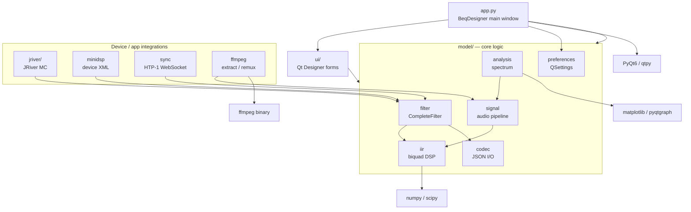

[](https://github.com/3ll3d00d/beqdesigner/actions)

# BEQDesigner

A Qt desktop app for designing, analysing and applying Bass EQ (BEQ) filters for
movie soundtracks.

**User documentation lives at [beqdesigner.readthedocs.io](https://beqdesigner.readthedocs.io/).**
Start there if you want to know what BEQ is, how to install a release build, or
how to use the app. This README is for developers working on the source.

## Developer quickstart

Requirements: Python 3.13, [Poetry](https://python-poetry.org/), and (optional,
runtime only) `ffmpeg` + `graphviz`.

```sh
poetry env use python3.13
poetry install
PYTHONPATH=./src/main/python poetry run python src/main/python/app.py
```

The `PYTHONPATH` prefix matches how CI invokes the app and tests — the source
root is `src/main/python`, not the repo root.

### Tests

```sh
PYTHONPATH=./src/main/python poetry run pytest --cov=./src/main/python
```

Tests live in `src/test/python/` and run on every push via
`.github/workflows/test.yaml` across Linux, macOS and Windows.

### Building the app bundle

Release binaries are produced by PyInstaller from `beqdesigner.spec`:

```sh
poetry run pip install pyinstaller
poetry run pyinstaller --clean --log-level=INFO beqdesigner.spec
```

On macOS this yields `dist/beqdesigner.app`. On Linux a virtual X server is
required (`Xvfb`) — see the `Create distribution` step in `test.yaml` for the
exact invocation used in CI.

## Project layout

| Path | Contents |
|---|---|
| `src/main/python/app.py` | Entry point — creates `QApplication` and `BeqDesigner` main window |
| `src/main/python/ui/` | Qt Designer `.ui` files and their generated `.py` equivalents, plus view code |
| `src/main/python/model/` | Non-UI logic: filters, signals, IIR, ffmpeg, minidsp, jriver, htp1, checker, preferences, … |
| `src/main/python/acoustics/` | DSP helpers (smoothing, weighting, standards) |
| `src/main/python/mpl.py`, `svg.py`, `style/` | Matplotlib integration, SVG export, mpl styles |
| `src/test/python/` | pytest suite + fixtures |
| `beqdesigner.spec` | PyInstaller build recipe (Windows / Linux / macOS branches) |
| `.github/workflows/` | `test.yaml` (CI) and `create-app.yaml` (release builds) |
| `docs/` | Source for the readthedocs site (MkDocs) |

## Architecture



See [`docs/architecture.md`](docs/architecture.md) for a longer walkthrough of
each subsystem.

## Working with Qt Designer files

Forms are edited as `.ui` files in Qt Designer and compiled to Python with
`pyuic6`:

```sh
cd src/main/python/ui
poetry run pyuic6 foo.ui -o foo.py
```

To regenerate every form at once:

```sh
poetry run ui-gen
# or, equivalently:
poetry run python scripts/regen_ui.py
```

(`src/main/python/ui/convert.sh` and `convert.bat` are kept for reference but
have hard-coded paths to a contributor's venv — prefer `poetry run ui-gen`.)

Generated `.py` files **are** checked in — regenerate them whenever the `.ui`
changes. Do not hand-edit the generated files. To catch this automatically:

```sh
poetry run pip install pre-commit
pre-commit install
```

Once installed, staging a modified `.ui` triggers the hook (defined in
`.pre-commit-config.yaml`), which runs `ui-gen` and re-stages the matching
`.py`. A CI job (`ui-sync-check` in `.github/workflows/test.yaml`) performs the
same check on every push and fails if the committed `.py` files drifted from
their `.ui` sources.

## Conventions worth knowing

- `qtpy` is used as the Qt abstraction layer but the environment is pinned to
  PyQt6 at the top of `app.py`. Import from `qtpy.*`, not `PyQt6.*`, in new code.
- Logging goes through an in-memory `RollingLogger` (`model/log.py`) surfaced
  via *Help → Logs* in the UI — there is no on-disk log file, so run from a
  terminal to see tracebacks.
- User settings are stored via `QSettings` under
  `~/Library/Preferences/com.3ll3d00d.beqdesigner.plist` (macOS) /
  registry (Windows) / `~/.config/3ll3d00d/beqdesigner.conf` (Linux).
- Version string is read from `src/main/python/VERSION` — CI writes the short
  git SHA into this file at build time; running from source without it falls
  back to `0.0.0-alpha.1`.

## Active spike: auto-BEQ "magic wand" (feats/magic-wand branch)

This branch contains an **in-flight research spike** exploring whether
BEQ filter chains can be proposed automatically from a measured LFE
curve — "take the human out of BEQ-making". It is NOT production code
and will be cleaned up/removed before any merge to main. The spike
lives alongside the regular codebase in its own subtree
(`src/main/python/model/auto_beq*.py`,
`src/test/python/spike/`, `scripts/spike_auto_beq.py`,
`scripts/run-spike-tests.sh`).

Read in this order if you're picking up the spike mid-flight:

1. **Vision** — [`docs/design/auto_beq.md`](docs/design/auto_beq.md):
   what the feature is for, the three-tier roadmap (magic-wand button
   → ezBEQ send → HA zero-touch), pipeline architecture, validation
   methodology, known limitations.
2. **Plan for this iteration** —
   [`docs/design/auto_beq_plan.md`](docs/design/auto_beq_plan.md):
   the LLM-assisted Advisor abstraction currently being built
   (heuristic / mock / Ollama backends, library-sweep benchmark).
3. **Running log** —
   [`docs/design/auto_beq_experiments.md`](docs/design/auto_beq_experiments.md):
   append-only record of every experiment tried, what worked, what
   failed, and why. Source of truth for "did we already try X".

Run the spike test suite:

```sh
AUTO_BEQ_ADVISOR=mock bash scripts/run-spike-tests.sh     # deterministic
AUTO_BEQ_ADVISOR=ollama bash scripts/run-spike-tests.sh   # needs ollama serve
```

## Further reading

- User guide, workflows and UI reference: <https://beqdesigner.readthedocs.io/>
- Concepts (what BEQ is, pre- vs post-bass-management): `docs/index.md`,
  `docs/concepts.md`, `docs/workflow/`
- Install instructions for release binaries: <https://beqdesigner.readthedocs.io/en/latest/install/>
- Release/download page: <https://github.com/3ll3d00d/beqdesigner/releases>
