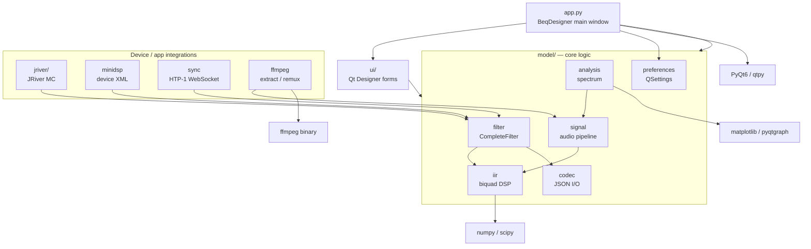

[](https://github.com/3ll3d00d/beqdesigner/actions)

# BEQDesigner

A Qt desktop app for designing, analysing and applying Bass EQ (BEQ) filters for
movie soundtracks.

**User documentation lives at [beqdesigner.readthedocs.io](https://beqdesigner.readthedocs.io/).**
Start there if you want to know what BEQ is, how to install a release build, or
how to use the app. This README is for developers working on the source.

## Developer quickstart

Requirements: Python 3.13, [Poetry](https://python-poetry.org/), and (optional,
runtime only) `ffmpeg` + `graphviz`.

```sh
poetry env use python3.13
poetry install
PYTHONPATH=./src/main/python poetry run python src/main/python/app.py
```

The `PYTHONPATH` prefix matches how CI invokes the app and tests — the source
root is `src/main/python`, not the repo root.

### Tests

```sh
PYTHONPATH=./src/main/python poetry run pytest --cov=./src/main/python
```

Tests live in `src/test/python/` and run on every push via
`.github/workflows/test.yaml` across Linux, macOS and Windows.

### Building the app bundle

Release binaries are produced by PyInstaller from `beqdesigner.spec`:

```sh
poetry run pip install pyinstaller
poetry run pyinstaller --clean --log-level=INFO beqdesigner.spec
```

On macOS this yields `dist/beqdesigner.app`. On Linux a virtual X server is
required (`Xvfb`) — see the `Create distribution` step in `test.yaml` for the
exact invocation used in CI.

## Project layout

| Path | Contents |
|---|---|
| `src/main/python/app.py` | Entry point — creates `QApplication` and `BeqDesigner` main window |
| `src/main/python/ui/` | Qt Designer `.ui` files and their generated `.py` equivalents, plus view code |
| `src/main/python/model/` | Non-UI logic: filters, signals, IIR, ffmpeg, minidsp, jriver, htp1, checker, preferences, … |
| `src/main/python/acoustics/` | DSP helpers (smoothing, weighting, standards) |
| `src/main/python/mpl.py`, `svg.py`, `style/` | Matplotlib integration, SVG export, mpl styles |
| `src/test/python/` | pytest suite + fixtures |
| `beqdesigner.spec` | PyInstaller build recipe (Windows / Linux / macOS branches) |
| `.github/workflows/` | `test.yaml` (CI) and `create-app.yaml` (release builds) |
| `docs/` | Source for the readthedocs site (MkDocs) |

## Architecture



See [`docs/architecture.md`](docs/architecture.md) for a longer walkthrough of
each subsystem.

## Working with Qt Designer files

Forms are edited as `.ui` files in Qt Designer and compiled to Python with
`pyuic6`:

```sh
cd src/main/python/ui
poetry run pyuic6 foo.ui -o foo.py
```

To regenerate every form at once:

```sh
poetry run ui-gen
# or, equivalently:
poetry run python scripts/regen_ui.py
```

(`src/main/python/ui/convert.sh` and `convert.bat` are kept for reference but
have hard-coded paths to a contributor's venv — prefer `poetry run ui-gen`.)

Generated `.py` files **are** checked in — regenerate them whenever the `.ui`
changes. Do not hand-edit the generated files. To catch this automatically:

```sh
poetry run pip install pre-commit
pre-commit install
```

Once installed, staging a modified `.ui` triggers the hook (defined in
`.pre-commit-config.yaml`), which runs `ui-gen` and re-stages the matching
`.py`. A CI job (`ui-sync-check` in `.github/workflows/test.yaml`) performs the
same check on every push and fails if the committed `.py` files drifted from
their `.ui` sources.

## Conventions worth knowing

- `qtpy` is used as the Qt abstraction layer but the environment is pinned to
  PyQt6 at the top of `app.py`. Import from `qtpy.*`, not `PyQt6.*`, in new code.
- Logging goes through an in-memory `RollingLogger` (`model/log.py`) surfaced
  via *Help → Logs* in the UI — there is no on-disk log file, so run from a
  terminal to see tracebacks.
- User settings are stored via `QSettings` under
  `~/Library/Preferences/com.3ll3d00d.beqdesigner.plist` (macOS) /
  registry (Windows) / `~/.config/3ll3d00d/beqdesigner.conf` (Linux).
- Version string is read from `src/main/python/VERSION` — CI writes the short
  git SHA into this file at build time; running from source without it falls
  back to `0.0.0-alpha.1`.

## Auto-BEQ spike (research)

Research spike exploring automated BEQ filter generation from measured
LFE audio — "take the human out of BEQ-making".

### Quick start (Docker, recommended for NAS / servers)

The LFE extractor — the slow, library-scanning step — ships as a small
Docker image (Python 3.13 slim + ffmpeg + a handful of stdlib-only
modules). Use this on your NAS to extract WAVs without installing
Python or scipy/PyQt deps.

```sh
# 1. Build the image locally (from repo root)
docker build -f docker/Dockerfile -t beq-extract .

# 2. Push it to your NAS over SSH
docker save beq-extract | ssh nas docker load

# 3. Copy the example compose config and edit volume paths to match
#    your NAS layout (media roots, beq working directory).
scp docker/docker-compose.example.yml nas:/path/to/beqdesigner/docker-compose.yml
ssh nas
nano /path/to/beqdesigner/docker-compose.yml  # edit volume mounts

# 4. Run extraction (resumes from cache, breadth-first ordering)
ssh nas
cd /path/to/beqdesigner
docker compose run beq-lfe-extract

# 5. Verify cache integrity later
docker compose run beq-wav-verify
```

Service names are prefixed with `beq-` so they don't collide with any
other Docker services on the same host.

After code changes, rebuild and redeploy:
```sh
docker build -f docker/Dockerfile -t beq-extract .
docker save beq-extract | ssh nas docker load
# No need to re-copy the compose config — the image change is enough.
```

**Outputs (written to `{beq-dir}/` on the NAS):**

| File | Purpose |
|---|---|
| `wav-cache/...` | Extracted LFE WAVs (the training set) |
| `beq_catalogue.json` | Local cache of the BEQ GitHub catalogue |
| `media_inventory.json` | Every media file with a `[tmdb-NNN]`/`[tvdb-NNN]` tag (matched + unmatched). Used to dedupe acquisition recommendations. |
| `missing_ids.txt` | Plain-text list of media files **without** DB ID tags. Renaming them to add the correct tag would let the model learn from them. |

**Pull results back to dev machine** for analysis:
```sh
scp nas:/path/to/beqdesigner/{media_inventory.json,beq_catalogue.json} \
    ~/Downloads/beqdesigner/

# Then locally generate bias and acquisition reports:
poetry run python3 scripts/nn_cache_bias_report.py -o docs/wav_cache_bias.md
poetry run python3 scripts/nn_acquisition_recommender.py -n 50 \
    -o docs/acquisition_recommendations.md
```

### Quick start (local Python, for dev / single machine)

If you don't have a NAS or want to run everything on one machine:

**Prerequisites:** Python 3.13, Poetry, ffmpeg + ffprobe on PATH.

```sh
# 1. Install deps
poetry install

# 2. Configure your audio cache dir + library roots
#    Edit ~/.config/beqdesigner/settings.json:
#    {
#      "audio_cache_dir": "~/Downloads/beqdesigner/audio-cache",
#      "library_roots": ["/path/to/your/Movies", "/path/to/your/TV"]
#    }

# 3. Discover your media and match against the BEQ catalogue
bash scripts/run-sweep-discover.sh

# 4. Run the auto-BEQ pipeline across discovered media
#    (extracts LFE audio, proposes filters, grades against catalogue)
bash scripts/run-sweep-tests.sh
```

Step 3 walks your library roots, finds media files, matches titles
against the BEQ catalogue (~14,700 entries), and saves the results.
Step 4 runs the auto-generation algorithm on each matched file and
compares the output to the catalogue's expert-authored filters.

### Quick start (local CI on a Windows build box)

If you have a spare beefy Windows machine (the reference one is
called `grumpy`: Windows + RTX GPU) and want it to automatically run
the **full** spike test + experiment suite whenever you push to a
branch called `div/local-integration`, there's a push-triggered
GitHub Actions workflow wired up for it. Trigger is push-based (no
polling), runtime is Docker-based (`docker/Dockerfile.test`), and
concurrency control means a rapid push burst just cancels the older
in-flight run instead of queueing up N builds.

**Prerequisites on the Windows box**: Docker Desktop with WSL2
backend, Git for Windows, PowerShell 7.

```powershell
# 1. Clone the repo anywhere convenient
git clone https://github.com/astubbs/beqdesigner.git
cd beqdesigner

# 2. Map the NAS share to a drive letter so Docker can bind-mount it
#    (Docker cannot mount UNC \\nas\... paths directly)
net use Z: \\nas\share /persistent:yes

# 3. One-shot interactive bootstrap — persists WAV cache + BEQ dir
#    paths under C:\ProgramData\beqdesigner-ci\config.json. Each
#    prompt has a 30 s timeout so it crashes fast if run headless.
pwsh scripts/win/Configure-LocalIntegration.ps1

# 4. Register this box as a self-hosted GitHub Actions runner
#    → GitHub repo → Settings → Actions → Runners → New self-hosted
#      runner → follow the copy-pasteable block. Add `grumpy` as an
#      extra label when prompted.
#    → .\svc.cmd install
#    → .\svc.cmd start

# 5. Smoke test the Docker rig without touching GitHub
pwsh scripts/win/Run-ExperimentBuild.ps1 -Scope unit
```

After that, every push to `div/local-integration` triggers the
`local-integration full suite` workflow on your runner. Spike logs
upload as GitHub artifacts so you can read failures from the Actions
UI without RDP-ing into the box. See
[`docs/local_integration.md`](docs/local_integration.md) for the
full walkthrough, troubleshooting, and teardown.

### Scripts

| Script | Purpose |
|---|---|
| `scripts/run-sweep-discover.sh` | Discover media in your library, match against BEQ catalogue. Interactive: prompts for library paths on first run, remembers them after. |
| `scripts/run-sweep-tests.sh` | Run the auto-BEQ pipeline on discovered media. Wraps pytest with correct env. Supports `AUTO_BEQ_SWEEP_LIMIT=N` to cap how many files to process. |
| `scripts/run-spike-tests.sh` | Run the fast unit-only spike suite (~1 min). Excludes `integration` + `experiment` markers by default. Use `SPIKE_TEST=...` to select specific tests, `SPIKE_VERBOSE=1` for full output. |
| `scripts/run-spike-integration.sh` | Run spike tests marked `integration` — opt-in. Needs real media files / TMDb / Ollama / populated sweep config. Tests skip gracefully if their resources are missing. |
| `scripts/run-spike-experiments.sh` | Run spike tests marked `experiment` — opt-in. Retrains F/G/H/I model batches and the real-audio training regime (E77/E82). Minutes to hours per test. Not for CI. |
| `scripts/spike_auto_beq.py` | Interactive CLI playground for testing auto-BEQ on a single title. |
| `scripts/extract_lfe.py` | Standalone LFE extractor — scans media roots, extracts LFE WAVs to portable cache. Used directly or via Docker (see below). |
| `scripts/verify_wav_cache.py` | Validate WAV cache integrity (header + duration check). |
| `scripts/wav_cache_status.py` | Summarise WAV cache: counts, titles, author breakdown. |
| `scripts/nn_cache_bias_report.py` | Compare WAV cache distribution to the full BEQ catalogue, surface bias and missing-ID files. |
| `scripts/nn_acquisition_recommender.py` | Recommend N missing catalogue titles to acquire (greedy bias correction). Excludes titles already in your library via `media_inventory.json`. |
| `scripts/nn_author_pattern_report.py` | Per-author distribution analysis from the BEQ catalogue. |
| `scripts/nn_comparison_report.py` | Compare NN-predicted vs hand-coded BEQ filters across your WAV cache. |
| `scripts/train_production_model.py` | Train + save the production BEQ model (E82 50:1 weighted hybrid). Output: `{beq-dir}/production_model.joblib` + `.meta.json` sidecar. Run once per WAV cache update. |
| `scripts/generate_beq_profile.py` | Generate complete BEQ profiles (filters + biquads + spectrographs + catalogue-compatible JSON) for uncatalogued media. Loads the saved production model; falls back to inline training if absent. |


### Environment variables

| Var | Purpose | Default |
|---|---|---|
| `AUTO_BEQ_ADVISOR` | Which advisor: `measurement` (signal-only), `ollama` (LLM), `mock`, `heuristic` | `measurement` |
| `AUTO_BEQ_SWEEP_LIMIT` | Max media files to process in sweep | `10` |
| `OLLAMA_MODEL` | Ollama model name | `qwen:14b` |
| `SPIKE_TEST` | Pytest selector for run-spike-*.sh wrappers | all spike tests |
| `SPIKE_MARKERS` | Override default marker filter in `run-spike-tests.sh` | `not integration and not experiment` |
| `SPIKE_VERBOSE` | `1` to show stdout from tests | `0` |
| `AUTO_BEQ_MODEL_PATH` | Override path for the trained XGBoost model loaded by `AUTO_BEQ_ADVISOR=trained_model`. Falls back to `{beq-dir}/production_model.joblib`. | (auto-discover) |

### Design docs

- [`docs/design/auto_beq.md`](docs/design/auto_beq.md) — vision + architecture
- [`docs/design/auto_beq_experiments.md`](docs/design/auto_beq_experiments.md) — experiment log (ongoing, current champion: E82 50:1 weighted hybrid)
- [`docs/design/auto_beq_library_sweep_plan.md`](docs/design/auto_beq_library_sweep_plan.md) — sweep quick-start
- [`branch-plans/plan-sharp-goldberg.md`](branch-plans/plan-sharp-goldberg.md) — current branch plan

## Further reading

- User guide, workflows and UI reference: <https://beqdesigner.readthedocs.io/>
- Concepts (what BEQ is, pre- vs post-bass-management): `docs/index.md`,
  `docs/concepts.md`, `docs/workflow/`
- Install instructions for release binaries: <https://beqdesigner.readthedocs.io/en/latest/install/>
- Release/download page: <https://github.com/3ll3d00d/beqdesigner/releases>
